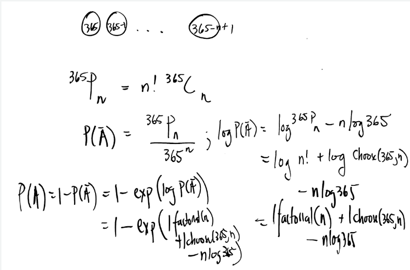

```{r, include = FALSE}
knitr::opts_chunk$set(
  collapse = TRUE,
  comment = "#>"
)
```

```{r setup}
library(MATH4753F25mooketsi)
```


$$
P(\text{at least one shared birthday among } n \text{ people})
= 1 - P(\text{all birthdays distinct}).
$$

$$
P(\text{all distinct})
= \prod_{k=0}^{n-1}\left(1-\frac{k}{365}\right)
= \frac{365!}{(365-n)! \, 365^n}.
$$

$$
P(\text{at least one shared birthday})
= 1 - \frac{365!}{(365-n)! \, 365^n}.
$$

$$
\ln P(\text{all distinct})
= \sum_{k=0}^{n-1}\ln\!\left(1-\frac{k}{365}\right)
\approx -\frac{n(n-1)}{2\cdot 365}.
$$

$$
P(\text{at least one shared birthday})
\approx 1-\exp\!\left(-\frac{n(n-1)}{2\cdot 365}\right).
$$

</center>

<center>
{ width=70% }

birthday <- function(x) {

  1-exp(lchoose(365,x)+ lfactorial(x) - x*log(365))
}

```{r}
birthday(20:25)
```

